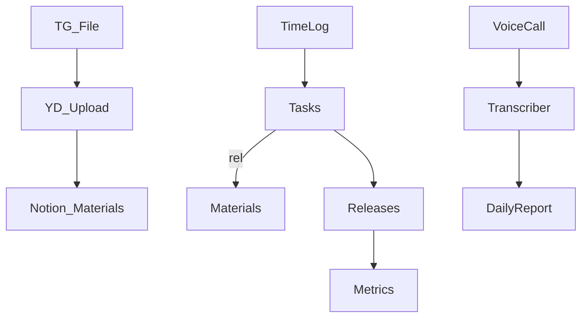

# 🖼️ Дашборд Эффективности Дизайнеров — v1.1 (18-01-2025)

## 0. Самокритика v1.0

- Не было явной привязки к критическим правилам проекта (производительность, отсутствие ломающих изменений, покрытие тестами 80%).
- Метрики: не определены базовые значения и ответственные; CTR должен считаться из базы Releases, а не Tasks.
- Автоматизация: не был описан список триггеров, не учтён cost_monitor и fallback-очередь.
- Мультидизайнер: не определена прозрачность по каждому дизайнеру.
- Риски: не прописан fallback при сбоях Notion API.
- Документация: не было перекрёстных ссылок на ключевые доки (AI_CONTEXT, FEATURES, DAILY_WORKFLOW).

## 1. Актуализированные цели

| KPI | Цель | Ответственный | База (T-1н) |
|-----|------|---------------|-------------|
| эффективность | ≥ 0.80 | Дизайнеры | _TBD_ |
| просрочки | ≤ 0.05 | PM | _TBD_ |
| качество | ≥ 0.99 | QA | _TBD_ |
| покрытие отчётами | 100 % | Дизайнеры | _TBD_ |

`бонус = base * (1 + эффективность*0.2 + качество*0.3 − просрочки*0.3)`

## 1.1 Личные KPI руководителя/AI-агента (2025-01-18)

| KPI | Цель | Комментарий |
|-----|------|-------------|
| Время реакции на запросы команды | ≤ 2 мин | Среднее время ответа на вопросы дизайнеров |
| Involvement Rate | ≥ 80% | % задач, где руководитель реально поучаствовал |
| Инсайты/улучшения (неделя) | ≥ 3 | Внедрённые новые практики/идеи |
| Скорость стадий (до/после запуска) | < 1 день / < 3 дня | Среднее время прохождения задач по стадиям |
| Автоматизация (AI/бот) | ≥ 50% | % задач с автоматизированными действиями |
| Flow state | ≥ 2/день | Кол-во задач, где был достигнут поток |
| Обратная связь от дизайнеров | ≥ 1/день | Кол-во полученной обратной связи |
| Новые практики в команде | ≥ 1/неделя | Внедрено новых стандартов/паттернов |

---

## 1.2 Чек-лист подготовки к завтрашнему дню (руководитель)
- [ ] Сформировать список задач для себя и команды
- [ ] Проверить статус обоих ботов (corporate_bot и life_bot)
- [ ] Настроить автоматическое логирование действий (AI Worklog)
- [ ] Запросить отчёты у всех дизайнеров
- [ ] Провести быструю встречу/созвон (если нужно)
- [ ] Зафиксировать инсайты/идеи для улучшения процессов
- [ ] Проверить прозрачность задач и вовлечённость
- [ ] Обновить дашборд KPI

---

## 1.3 Использование двух ботов для максимальной эффективности
- **corporate_bot**: автоматизация корпоративных задач, сбор KPI по дизайнерам, отчёты, напоминания.
- **life_bot**: личный AI Worklog, трекинг твоих метрик, генерация инсайтов, логирование новых практик.
- **Синергия**: лучшие практики и инсайты автоматически попадают в общий Experience Hub, доступный обоим ботам.

---

## 2. Изменения в структуре Notion

### 2.1 Лог времени (НОВОЕ)
- `дата` (дата)
- `задача` (связь → Tasks)
- `затрачено_минут` (число)
- `дизайнер` (связь → Users)

### 2.2 Задачи (ИЗМЕНЕНИЯ)
- `план_минут` (число)
- `затрачено_минут` (roll-up → Лог времени)
- `эффективность` (формула)

### 2.3 Ежедневные отчёты (ИЗМЕНЕНИЯ)
- `транскрипт_встречи` (rich text)
- `скриншоты` (файлы)
- `упомянутые_задачи` (связь → Tasks)

## 3. Автоматизация (триггеры)

| Триггер | Действие | Скрипт |
|---------|----------|--------|
| Загрузка файла в TG | Загрузка в ЯД + создание материала в Notion | `services/media_cover_manager.py` |
| Статус задачи **Готово** | Создать/обновить строку в Логе времени | `services/notion/automation.py:add_time_log` |
| Крон в конце дня | Генерация страницы Daily Report | `services/notion/automation.py:generate_daily_report` |
| Ревизия задачи > 0 | TG-уведомление дизайнеру | `services/telegram/handlers/tasks.py:notify_revision` |
| `затрачено / план > 1.2` | DeepSeek совет "оптимизировать процесс" | `services/llm/deepseek_optimizer.py` |

## 4. Диаграмма потоков данных

## 5. Таймлайн

- **Сегодня, 18 января**
  1. Реализовать БД Лога времени и миграцию (`_migration_20250118_timelog.py`).
  2. Пропатчить Tasks: добавить `план_минут`, формулы.
  3. Прототип шаблона Daily Report (сервис + Notion).
- **+48 ч**
  - Автоматизировать создание Лога времени через webhook.
  - Представление "Обзор недели" для дизайнеров.
- **+7 дней**
  - Автоподсчёт KPI; экспорт бонусов в CSV.

## 6. Риски и защитные меры

- **Rate-limit**: пакетные операции с экспоненциальным бэкоффом.
- **Fallback-очередь**: при ошибках Notion 429/5xx — буферизация в SQLite (`utils/offline_queue.py`).
- **Приватность**: транскрипты только в Daily Reports (ограниченные права).

## 7. Ближайшие действия

1. Утвердить скрипты миграции схемы.
2. Задать базовые значения `план_минут` по активным задачам.
3. Подтвердить формулу бонуса. 